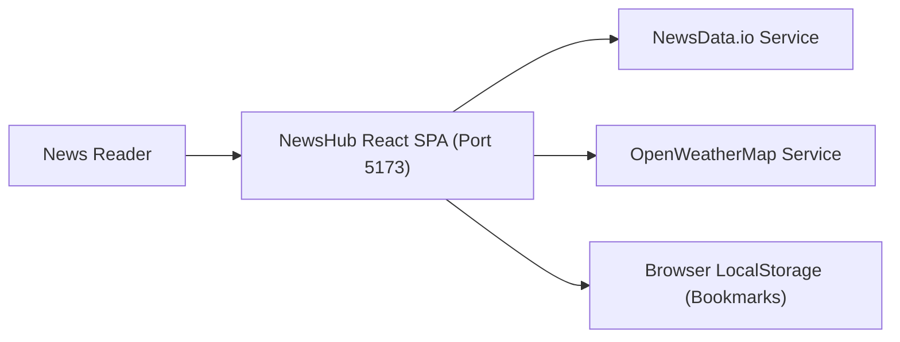
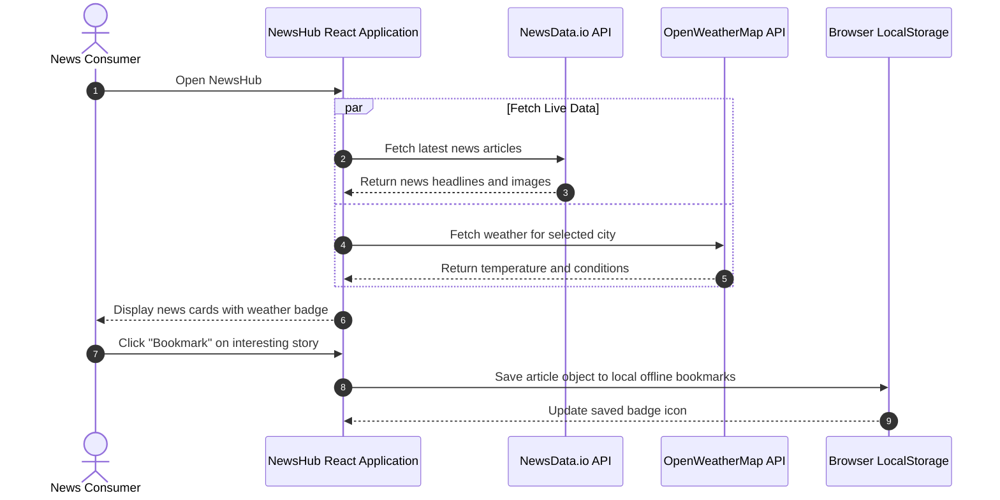

# NewsHub — Real-Time Breaking News & Weather Aggregator
[]()
[]()
[]()
[]()

## Overview
NewsHub is a fast, responsive global news and local weather aggregator built with React 18, Vite, Tailwind CSS, and Shadcn UI. It delivers breaking news across multiple categories (Technology, Business, Sports, Entertainment, Health) powered by the NewsData.io API, alongside real-time local weather observations from OpenWeatherMap.

- **Problem Solved:** Fast, distraction-free consumption of curated global news and local meteorological forecasts.
- **Target Users:** General news readers, market watchers, and everyday web users.
- **Current Status:** Functional Web Application.

## Features
- **Multi-Category News Ingestion:** Real-time query execution across top international categories.
- **Local Weather Widget:** Real-time temperature, condition icons, and city-based weather search.
- **Offline Article Bookmarks:** Save articles locally via browser localStorage for offline reading.
- **Modern Responsive UI:** Polished reading layout with dark/light mode toggle.

## Architecture


## User Flow


## Technology Stack
| Layer | Technology | Purpose |
|---|---|---|
| Framework | React 18, Vite | High-performance client-side rendering |
| Language | TypeScript | Type safety for external news data schemas |
| Styling | Tailwind CSS, Shadcn UI | Modern news editorial design system |
| APIs | NewsData.io, OpenWeatherMap | External REST data providers |

## Infrastructure
- **Development Port:** 5173
- **Hosting Target:** Vercel / Netlify / GitHub Pages

## Project Structure
```text
News/
├── src/
│   ├── components/      # NewsCard, WeatherWidget, CategoryFilter, Navbar
│   ├── services/        # newsService.ts, weatherService.ts, localStorageService.ts
│   ├── types/           # NewsArticle, WeatherData TypeScript interfaces
│   ├── App.tsx          # Root view and category state
│   └── main.tsx         # Mounting entry
├── .env.example         # Template for external API keys
├── vite.config.ts       # Vite configuration
├── .gitignore           # Git ignore definitions
└── README.md            # Technical documentation
```

## Prerequisites
- Node.js >= 18.x
- Free API Keys from [NewsData.io](https://newsdata.io/) and [OpenWeatherMap](https://openweathermap.org/)

## Environment Variables
Create `.env` using placeholders:
```env
VITE_NEWS_API_KEY=your_newsdata_io_api_key_here
VITE_OPENWEATHER_API_KEY=your_openweather_api_key_here
```

## Local Development Setup
1. Clone the repository:
   ```bash
   git clone https://github.com/Bhanutejanallamothu/News.git
   cd News
   ```
2. Install dependencies:
   ```bash
   npm install
   ```
3. Configure environment variables:
   ```bash
   cp .env.example .env
   # Add your API keys to .env
   ```
4. Run development server:
   ```bash
   npm run dev
   ```
5. Open `http://localhost:5173`.

## Docker Setup
*Not detected in repository. Static SPA deployable to Nginx or Vercel.*

## Database Setup
*Not applicable. Offline persistence utilizes browser `localStorage`.*

## API Documentation
External APIs consumed:
- `https://newsdata.io/api/1/news` - News headlines query.
- `https://api.openweathermap.org/data/2.5/weather` - City weather query.

## Deployment
Build static production bundle:
```bash
npm run build
```
Deploy the `dist/` folder to Vercel or Netlify.

## Security
- API keys externalized via Vite environment variables (`import.meta.env`).
- Safe rendering of third-party news snippets with link sanitization.

## Testing
Run TypeScript build verification:
```bash
npm run build
```

## Troubleshooting
- **News Not Loading:** Verify your `VITE_NEWS_API_KEY` is valid and has not exceeded monthly rate limits.

## Future Improvements
- Full-text search with keyword highlighting.
- Audio text-to-speech article reader.

## License
No formal open-source license provided. All rights reserved by repository owner.
